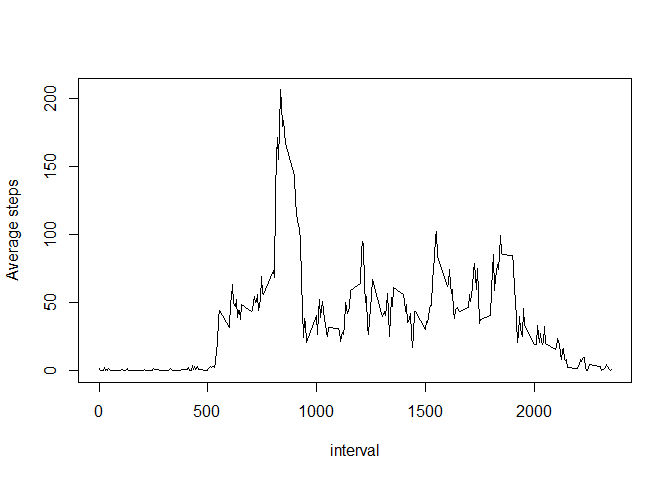

## Loading and preprocessing the data

This is the code needed for loading and preproccessing the data


```r
data <- read.csv(unz("activity.zip","activity.csv"))
```

## What is mean total number of steps taken per day?

Calculate the total number of steps taken per day and make an Histogram


```r
stepsbyday <- aggregate(data$steps, by=list(date=data$date), FUN=sum)
hist(stepsbyday$x, xlab = "Steps/day", main = "Histogram of steps/day")
```

<!-- -->

Calculate and report the mean and median of the total number of steps taken per day


```r
mean <- mean(stepsbyday$x, na.rm = TRUE)
print(mean)
```

```
## [1] 10766.19
```

```r
median <- median(stepsbyday$x, na.rm = TRUE)
print(median)
```

```
## [1] 10765
```

#
As shown above, the mean is 10766.19 steps/day and median is 10765 steps/day


## What is the average daily activity pattern?

Make a time series plot  of the 5-minute interval (x-axis) and the average number of steps taken, averaged across all days (y-axis)


```r
avstepsbyinterval <- aggregate(data$steps, by=list(interval=data$interval), FUN=mean, na.rm=TRUE)
plot(avstepsbyinterval$interval, avstepsbyinterval$x, type = "l",xlab = "interval", ylab = "Average steps")
```

<!-- -->

Which 5-minute interval, on average across all the days in the dataset, contains the maximum number of steps?


```r
maxavsteps <- max(avstepsbyinterval$x)
maxinterval <- avstepsbyinterval$interval[avstepsbyinterval$x %in% maxavsteps]
print(maxinterval)
```

```
## [1] 835
```
As shown above, the máximum average steps/day interval correspond to 835


## Imputing missing values

1. Calculate and report the total number of missing values in the dataset (i.e. the total number of rows with NAs)


```r
NAS <- sum(is.na(data$steps))
print(NAS)
```

```
## [1] 2304
```
The total number of NA's in the dataset is 2304

2. Devise a strategy for filling in all of the missing values in the dataset. The strategy does not need to be sophisticated. For example, you could use the mean/median for that day, or the mean for that 5-minute interval, etc.

I choose to fill it with the mean of the correspondatn 5-minute interval.

3. Create a new dataset that is equal to the original dataset but with the missing data filled in.

```r
data2 <- data
data2$steps[is.na(data$steps)] <- rep(avstepsbyinterval$x,61)[is.na(data$steps)]
```

4.Make a histogram of the total number of steps taken each day and Calculate and report the mean and median total number of steps taken per day. Do these values differ from the estimates from the first part of the assignment? What is the impact of imputing missing data on the estimates of the total daily number of steps?

Code for making the histogram


```r
stepsbyday2 <- aggregate(data2$steps, by=list(date=data2$date), FUN=sum)
hist(stepsbyday2$x, xlab = "Steps/day", main = "Histogram of steps/day")
```

<!-- -->

Code for mean and median


```r
mean <- mean(stepsbyday2$x)
print(mean)
```

```
## [1] 10766.19
```

```r
median <- median(stepsbyday2$x)
print(median)
```

```
## [1] 10766.19
```


The mean for fixed data is 10766.19 steps/day and the median is 10766.19 steps/day.
They differ from the first part but not significantly

## Are there differences in activity patterns between weekdays and weekends?

For this part the weekdays() function may be of some help here. Use the dataset
with the filled-in missing values for this part.


```r
weekday <- c("lunes","martes", "miércoles", "jueves", "viernes")
weekend <- c("sábado", "domingo")
data2 <- transform(data2, daytype = ifelse(weekdays(as.Date(date)) %in% weekday, "weekday","weekend"))
weekenddata <- subset(data2, daytype == "weekend")
weekdaydata <- subset(data2, daytype == "weekday")
avstepsbyintervalWE <- aggregate(weekenddata$steps, by=list(interval=weekenddata$interval), FUN=mean)
avstepsbyintervalWD <- aggregate(weekdaydata$steps, by=list(interval=weekdaydata$interval), FUN=mean)

par(mfrow = c(2,1), mar = c(4, 4, 3, 0))
with(avstepsbyintervalWE, plot(interval, x,type = "l",xlab = "interval", 
                               ylab = "Average steps",ylim = c(0, max(avstepsbyinterval$x, na.rm = TRUE)), main = "WEEKENDS"))
with(avstepsbyintervalWD, plot(interval, x,type = "l",xlab = "interval", 
                               ylab = "Average steps",ylim = c(0, max(avstepsbyinterval$x, na.rm = TRUE)), main = "WEEKDAYS"))
```

<!-- -->

